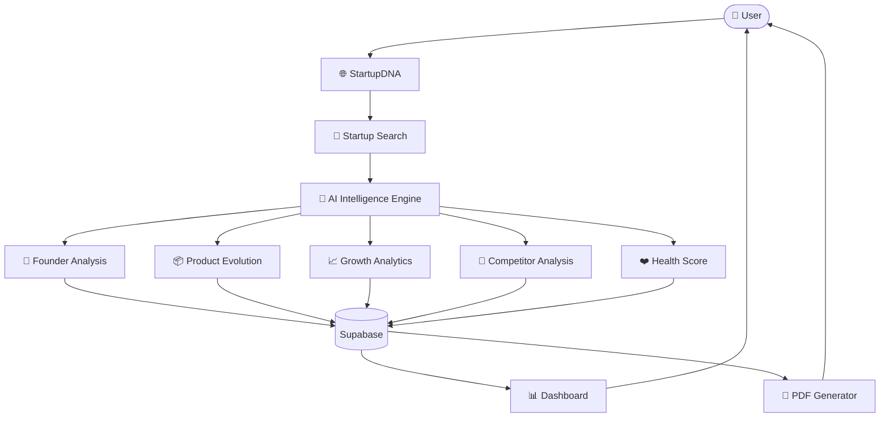
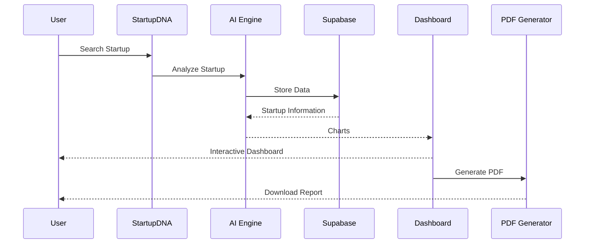

# 🚀 StartupDNA – AI-Powered Startup Intelligence Platform

<div align="center">


### 🚀 Decode the Architecture of Any Startup with AI

AI-powered Startup Intelligence Platform that transforms startup information into investor-grade reports, interactive dashboards, startup analytics, founder intelligence, competitor research, product evolution, and downloadable PDF reports.

⭐ If you like this project, please give it a star.

</div>

---

# 📖 Overview

StartupDNA is a modern AI-powered SaaS platform designed to analyze startups from multiple perspectives.

The platform enables founders, investors, researchers, students, and entrepreneurs to understand any startup by generating structured reports with beautiful visualizations.

Instead of manually researching dozens of sources, StartupDNA automatically organizes startup intelligence into a single investor-grade dashboard.

---

# ✨ Features

## 🤖 AI Intelligence

- AI Startup Analysis
- Founder Intelligence
- Product Evolution
- Competitor Research
- Startup Health Score
- Growth Timeline

## 📊 Business Intelligence

- Interactive Charts
- Revenue Analysis
- User Growth
- Market Position
- Funding Overview
- Valuation Insights

## 📄 Reports

- Investor Grade Reports
- Downloadable PDF
- Startup Archive
- Historical Reports

## 🎨 UI

- Modern Dashboard
- Fully Responsive
- Dark Mode
- Beautiful Animations
- Clean Components

---

# 📸 Screenshots

## 🏠 Home


---

## 📊 Dashboard


---

## 📈 Analytics


---

## 📦 Product Evolution


---

## 📄 PDF Report


---

# 🛠 Tech Stack

## Frontend

- React 19
- TypeScript
- Vite
- Tailwind CSS v4
- TanStack Router
- TanStack Query

## UI

- Radix UI
- Lucide React
- Sonner
- Embla Carousel
- Vaul

## Charts

- Recharts

## Forms

- React Hook Form
- Zod Validation

## Backend

- Supabase

---

# 🏗 System Architecture



---

# 🔄 Workflow



---

# 🖥 High-Level Architecture

```text

                  ┌──────────────────────────┐
                  │          USER            │
                  └────────────┬─────────────┘
                               │
                               ▼
              ┌────────────────────────────────┐
              │      StartupDNA Frontend       │
              │ React • TypeScript • Tailwind  │
              └────────────┬───────────────────┘
                           │
      ┌────────────────────┼─────────────────────┐
      │                    │                     │
      ▼                    ▼                     ▼
 Search Engine        Dashboard UI         Startup Archive
      │
      ▼
 ┌──────────────────────────────┐
 │     AI Intelligence Engine    │
 └─────────────┬─────────────────┘
               │
     ┌─────────┼──────────────────────────────┐
     ▼         ▼          ▼          ▼         ▼
 Founder   Product   Competitor   Growth   Health
Analysis   Timeline   Analysis   Metrics    Score

     └─────────┬──────────┬─────────┬────────┘
               ▼
        ┌───────────────┐
        │   Supabase    │
        └──────┬────────┘
               │
      ┌────────┼────────────┐
      ▼        ▼            ▼
 Dashboard   PDF        Archive
```

---

# ⚡ Key Highlights

- AI Powered Startup Intelligence
- Beautiful Dashboard
- Investor Grade Reports
- Interactive Charts
- PDF Export
- Fully Responsive
- Modern SaaS Design
- Production Ready UI

---
# 📂 Project Structure

```text
startup-chronicle/
│
├── public/
│
├── src/
│   ├── assets/
│   ├── components/
│   ├── hooks/
│   ├── lib/
│   ├── pages/
│   ├── routes/
│   ├── styles/
│   ├── types/
│   ├── utils/
│   ├── App.tsx
│   └── main.tsx
│
├── package.json
├── tsconfig.json
├── vite.config.ts
└── README.md
```

---

# 🚀 Getting Started

## Clone Repository

```bash
git clone https://github.com/Saurav6200907210/startup-chronicle.git
```

Move into project

```bash
cd startup-chronicle
```

Install dependencies

```bash
npm install
```

Run development server

```bash
npm run dev
```

Build production

```bash
npm run build
```

Preview production build

```bash
npm run preview
```

---

# ⚙ Environment Variables

Create a `.env` file in the root directory.

```env
VITE_SUPABASE_URL=your_supabase_url

VITE_SUPABASE_ANON_KEY=your_supabase_key

VITE_GEMINI_API_KEY=your_api_key
```

---

# 📦 Main Dependencies

| Package | Purpose |
|----------|---------|
| React 19 | Frontend |
| TypeScript | Type Safety |
| Tailwind CSS | Styling |
| TanStack Router | Routing |
| TanStack Query | Data Fetching |
| Supabase | Database |
| Recharts | Charts |
| React Hook Form | Forms |
| Zod | Validation |
| Radix UI | Components |
| Lucide React | Icons |
| Sonner | Toast Notifications |

---

# 🚀 Deployment

This project can be deployed on

- Vercel
- Netlify
- Cloudflare Pages
- Firebase Hosting
- AWS Amplify

Production Build

```bash
npm run build
```

---

# 📊 Roadmap

## Completed

- [x] Modern Dashboard
- [x] Startup Search
- [x] Founder Intelligence
- [x] Competitor Analysis
- [x] Product Evolution
- [x] Startup Health Score
- [x] Interactive Charts
- [x] PDF Export
- [x] Responsive UI
- [x] Dark Theme

---

## Upcoming Features

- [ ] AI Chat Assistant
- [ ] Live Startup News
- [ ] Crunchbase Integration
- [ ] Funding Prediction
- [ ] Market Opportunity Analysis
- [ ] Investor Recommendation Engine
- [ ] Startup Comparison
- [ ] Portfolio Management
- [ ] Multi-language Support
- [ ] Email Report Sharing
- [ ] Real-time Analytics

---

# 🎯 Use Cases

✔ Startup Research

✔ Founder Research

✔ Market Analysis

✔ Investor Due Diligence

✔ Startup Validation

✔ Product Research

✔ Business Intelligence

✔ Academic Research

✔ Competitive Analysis

✔ Entrepreneurship

---

# 🌟 Why StartupDNA?

StartupDNA combines Artificial Intelligence with Business Intelligence to create one centralized platform for startup research.

Instead of spending hours searching across multiple websites, StartupDNA generates structured insights, visual analytics, and downloadable investor-grade reports in seconds.

---

# 🤝 Contributing

Contributions are welcome!

1. Fork the repository

2. Create your feature branch

```bash
git checkout -b feature/new-feature
```

3. Commit your changes

```bash
git commit -m "Added new feature"
```

4. Push to GitHub

```bash
git push origin feature/new-feature
```

5. Open a Pull Request

---

# 🐛 Found a Bug?

Please open an issue describing

- Bug description
- Expected behavior
- Screenshots
- Steps to reproduce

---

# 📈 Future Vision

StartupDNA aims to become a complete AI-powered startup intelligence ecosystem by integrating:

- AI Agents
- Live Business Data
- Investor Tools
- Market Prediction
- Startup Ranking
- Automated Due Diligence
- Pitch Deck Generation
- Risk Assessment
- Business Forecasting

---

# 📄 License

Licensed under the MIT License.

Feel free to use this project for learning, research, and portfolio purposes.

---

# 👨‍💻 Author

## Saurav Kumar

Full Stack Developer • DevOps Enthusiast • AI Builder

GitHub

https://github.com/Saurav6200907210

---

# ⭐ Support

If you found this project useful, consider giving it a ⭐ on GitHub.

It motivates future development and helps others discover the project.

---

<div align="center">

## 🚀 StartupDNA

### AI-Powered Startup Intelligence Platform

**Built with ❤️ using React, TypeScript, Tailwind CSS, TanStack, Supabase & AI**

⭐ **Star this repository if you enjoyed the project!**

</div>
